<div align="center">

# OpenStack IaaS Platform — Built as Code

**A three-node private cloud (OpenStack 2024.2 "Dalmatian") deployed end-to-end with Ansible and Kolla-Ansible, running over a ZeroTier overlay with tenant VXLAN networking, Cinder LVM block storage, and externally reachable floating IPs.**


[Architecture](#architecture) · [Nodes & services](#physical-nodes-and-what-runs-on-each) · [RabbitMQ](#rabbitmq--the-nervous-system) · [Networking](#networking-design) · [Storage](#storage-design) · [Automation](#automation-pipeline) · [Incidents](#real-incidents-diagnosed-and-fixed) · [Screenshots](#proof-it-works-screenshots) · [Quick start](#quick-start)

</div>

---

## Executive summary

This project is a **fully automated Infrastructure-as-a-Service cloud** built from scratch on three machines, rather than consumed from a public provider. It implements the pieces a production IaaS needs: identity, compute scheduling, software-defined networking, block storage, an image registry, a dashboard, a load-balanced API endpoint, and a message bus that ties them together.

The whole stack is **reproducible from one configuration file**. A single variables file (`inventory/group_vars/all.yml`) is the source of truth; Kolla's inventory and `globals.yml` are *generated* from it, never hand-edited. Each phase ends with a verification gate, and the finished cloud is proven with an end-to-end workload test (boot VM → attach Cinder volume → assign floating IP → reach it through the router).

| | |
|---|---|
| **Cloud platform** | OpenStack 2024.2, every service containerised by Kolla-Ansible |
| **Footprint** | 3 nodes · 12 vCPU · 33 GB RAM · 160 GB disk |
| **Automation** | 10 Ansible playbooks, 4 helper scripts, 2 Jinja2 templates, one-command `make` targets |
| **Networking** | 3 isolated planes: management (ZeroTier), tenant (VXLAN), provider (flat/VLAN-free `physnet1`) |
| **Storage** | Cinder on LVM over iSCSI · Glance images on NFS · Swift disk pre-provisioned |
| **Operational record** | 15 documented incidents with evidence, root cause, fix and lesson |

---

## Architecture

### The big picture: every container, on every node


How to read it: solid arrows are runtime request paths, thick arrows are the message bus and storage data paths that cross the ZeroTier overlay, and dotted arrows are deployment and mount relationships.

### Three network planes, deliberately separated


| Plane | Technology | Carries | Why it is separate |
|---|---|---|---|
| **Management** | ZeroTier overlay, pinned IPs | REST APIs, MariaDB, RabbitMQ, iSCSI, SSH/Ansible, image transfer | Works across sites; addressing independent of hypervisor NAT |
| **Tenant** | VXLAN between OVS instances | Instance-to-instance traffic on user-defined networks | Tenants create isolated networks and routers without touching infrastructure |
| **Provider** | Flat network on a dedicated NIC → `br-ex` | Floating-IP traffic in and out of the cloud | A flat network needs real layer-2 adjacency; it cannot be stretched over a VPN |

---

## Physical nodes and what runs on each

Every OpenStack service is a Docker container managed by Kolla-Ansible (`2024.2-ubuntu-noble` images).

| Node | Resources | ZeroTier IP | Role | Special hardware |
|---|---|---|---|---|
| **controller** | 4 vCPU · 16 GB · 80 GB | `10.0.1.4` | Control plane · Ansible & Kolla deploy host · load balancer | — |
| *(VIP)* | — | `10.0.1.5` | Floating virtual IP for every API endpoint (Keepalived) | Assigned to no node in ZeroTier |
| **compute1** | 4 vCPU · 9 GB · 30 GB | `10.0.1.6` | Hypervisor **and** Neutron network node | Nested VT-x; provider NIC (`ens37`) + access NIC (`ens38`) on VMnet10 |
| **storage** | 4 vCPU · 8 GB · 50 GB | `10.0.1.7` | Block storage · image store | 20 GB OS + 15 GB Cinder disk + 15 GB Swift disk |

### `controller` — the brain

| Service | What it does |
|---|---|
| **Keystone** | Identity: users, projects, roles, tokens, service catalogue. Every other service authenticates here |
| **Glance** | Image registry; file backend lives on an NFS share exported by `storage` |
| **Nova** `api · scheduler · conductor · novncproxy` | Public compute API, host selection, database proxy for compute nodes, browser console |
| **Placement** | Tracks resource inventories and usage; feeds the Nova scheduler |
| **Neutron server** | Networking API and plugin logic |
| **Cinder** `api · scheduler` | Block-storage API and volume placement |
| **Horizon** | Web dashboard at `http://10.0.1.5` |
| **RabbitMQ** | The message bus between all services ([details below](#rabbitmq--the-nervous-system)) |
| **MariaDB + ProxySQL** | Persistent state for every service; ProxySQL routes DB connections |
| **Memcached** | Token and session cache |
| **HAProxy + Keepalived** | Single load-balanced API entry point on the VIP; Keepalived drops the VIP if health checks fail |
| **fluentd · cron · kolla-toolbox** | Log shipping, rotation, and the Ansible runtime Kolla uses for API calls |

### `compute1` — the muscle (and the network edge)

| Service | What it does |
|---|---|
| **nova-compute + libvirt + KVM** | Runs tenant VMs with hardware acceleration (nested virtualisation) |
| **Open vSwitch + OVS agent** | Builds `br-int`, `br-tun`, `br-ex`; terminates VXLAN tunnels; `br-ex` owns the provider NIC |
| **Neutron L3 agent** | Routers, SNAT, floating IPs — each router is a `qrouter-*` network namespace |
| **Neutron DHCP agent** | Addressing for tenant networks (`qdhcp-*` namespaces) |
| **Neutron metadata agent** | Instance metadata at `169.254.169.254` (cloud-init, keypairs) |
| **iscsid** | iSCSI initiator that logs in to volumes exported by `storage` |

### `storage` — the persistence layer

| Service | What it does |
|---|---|
| **cinder-volume (LVM)** | Creates volumes as logical volumes in VG `cinder-volumes` on a dedicated disk |
| **tgtd** | iSCSI target that exports those volumes to compute nodes |
| **NFS server** | Exports `/srv/glance-images` to the overlay subnet for Glance |
| **Swift disk (prepared)** | GPT partition `KOLLA_SWIFT_DATA`, XFS label `d0`, left unmounted as Kolla expects. Service intentionally off |

> **Design note:** the Neutron L3/DHCP/metadata agents run on `compute1`, not the controller, because that is the only node with a provider NIC. Routing next to the NIC means floating-IP traffic never crosses the slow overlay just to be routed. See [decision D3](docs/04-design-decisions.md#d3--neutron-network-agents-on-compute1).

---

## RabbitMQ — the nervous system

OpenStack is a set of independent services, often on different machines, that must cooperate without calling each other directly. **RabbitMQ is the message bus (AMQP) that carries their internal RPC and notifications** through `oslo.messaging`. It runs on the controller; every service on every node connects to it.

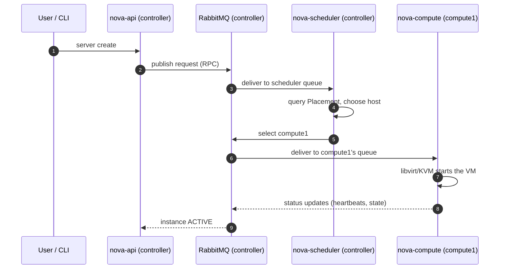

| Role of the bus | Concrete example in this cluster |
|---|---|
| **Decouples API from execution** | `nova-api` returns to the user immediately; the work is dispatched to `nova-compute` as a queued message |
| **Routes work to a specific node** | The scheduler's choice of `compute1` is delivered to that host's own queue |
| **Carries agent heartbeats** | The `:-)` / `XXX` "alive" column in `openstack network agent list` and `compute service list` is derived from heartbeats sent over RabbitMQ |
| **Keeps compute nodes off the database** | `nova-conductor` proxies DB access over RPC, so `compute1` never talks to MariaDB directly |
| **Spans the overlay** | Agents on `compute1` and `cinder-volume` on `storage` reach RabbitMQ across ZeroTier, which is why overlay latency shows up as agent flapping |

This coupling is a recurring thread in the operational record: after a ZeroTier restart the Neutron agents on `compute1` showed `XXX` until they reconnected to RabbitMQ ([incident 6](docs/05-troubleshooting-log.md#6--vip-vanished-after-a-zerotier-restart)), and measured overlay loss and latency ([incident 7](docs/05-troubleshooting-log.md#7--measuring-the-overlay-relayed-slow-lossy)) directly informed where each component was placed.

---

## Data paths

### Launching an instance

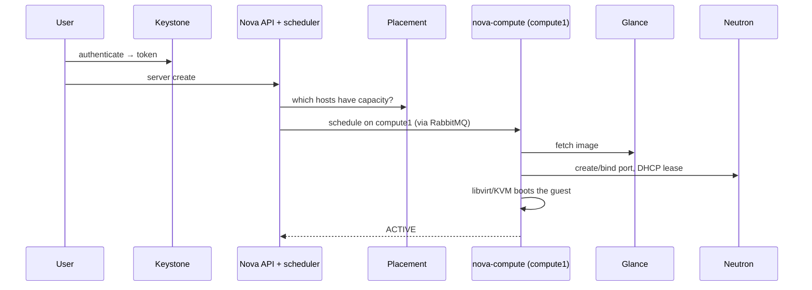

### Attaching a Cinder volume

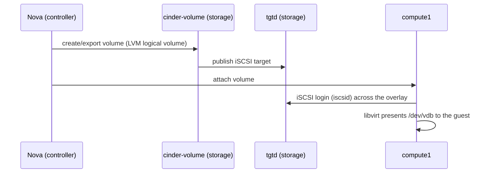

### Reaching an instance by floating IP from the overlay


Full write-up, including the return-route problem: [docs/06-floating-ip-access.md](docs/06-floating-ip-access.md).

---

## Networking design

| Decision | Choice | Rationale |
|---|---|---|
| Management fabric | ZeroTier overlay `10.0.1.0/24`, pinned IPs | Stable addressing across sites and hypervisor NAT |
| Tenant networks | VXLAN self-service behind a Neutron router | Isolation and tenant-owned routing — the standard production model |
| External access | Flat provider network `physnet1` on a dedicated NIC | Controlled single exit; floating IPs via DNAT |
| Network agents | Co-located with the provider NIC on `compute1` | Avoids hair-pinning routed traffic across the overlay |
| Load balancer | HAProxy + Keepalived forced onto the control node | Kolla's default placement (network nodes) caused 504s ([incident 3](docs/05-troubleshooting-log.md#3--keystone-504-because-the-load-balancer-was-on-the-wrong-node)) |
| Overlay → floating IPs | Dedicated plain-Linux access NIC + IP forwarding + a Neutron router return route | Leaves the OVS-owned NIC and the hypervisor host untouched |

**Cloud resources created by the automation**

| Resource | Type | Purpose |
|---|---|---|
| `ext-net` / `ext-subnet` | Flat provider network, no DHCP | Floating-IP pool `172.24.4.100–.200` |
| `tenant-net` / `tenant-subnet` | VXLAN network, DHCP, DNS `1.1.1.1` | Where instances live (`10.20.0.0/24`) |
| `demo-router` | Neutron router | SNAT for egress, floating-IP NAT |
| `m1.tiny`, `m1.small` | Flavors | Small test sizes |
| `cirros-0.6.2` | Image | Minimal infrastructure-test guest |
| `lab-key` | Keypair | From the controller's SSH key |
| `default` rules | Security group | ICMP + SSH ingress |

---

## Storage design

| Layer | Backend | Where | Notes |
|---|---|---|---|
| **Block** (Cinder) | LVM volume group `cinder-volumes` on a dedicated disk, exported over **iSCSI** (`tgtd`) | `storage` → attached on `compute1` | Every volume I/O crosses the overlay |
| **Images** (Glance) | File store on an **NFS** export (`/srv/glance-images`, restricted to the overlay subnet) | `storage` → mounted by `controller` | Verified by a mount-and-write preflight test |
| **Object** (Swift) | Disk prepared (GPT `KOLLA_SWIFT_DATA`, XFS `d0`) | `storage` | Service off; ring build is a later phase |

**Safety rails:** the storage playbook asserts that the Cinder and Swift disks differ from the OS disk and are unmounted before it touches them, and skips destructive tasks in check mode.

---

## Automation pipeline

```
inventory/group_vars/all.yml            <-- the ONLY file you edit
        │
        ├── templates/multinode.j2   ──┐   rendered by playbooks/11-kolla-config.yml
        └── templates/globals.yml.j2 ──┤
                                       ▼
                 /etc/kolla/multinode  +  /etc/kolla/globals.yml
                                       ▼
                 scripts/kolla.sh → kolla-ansible (pinned venv /opt/kolla-venv)
                                       ▼
                                   OpenStack
```

### Four phases, each with a verification gate

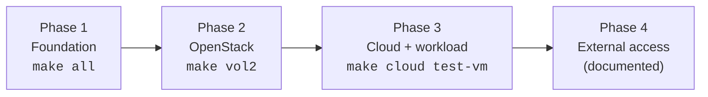

| Phase | Playbook / target | What it does | Gate |
|---|---|---|---|
| 1 | `00-sudoers` | Per-node passwordless sudo for the automation account | `whoami` → `root` everywhere |
| 1 | `01-baseline` | Hostnames, `/etc/hosts`, packages, chrony, swap off | Hosts entries present, swap `0` |
| 1 | `02-network` | Discovers the ZeroTier interface, asserts static IPs | `/etc/openstack-lab.env` written |
| 1 | `03-storage` | Cinder VG, Swift partition, Glance NFS export | `vgs`, `lsblk`, `exportfs -v` |
| 1 | `04-compute` | Asserts VT-x and `/dev/kvm`; provider NIC up with no IP | `kvm-ok` |
| 1 | `99-preflight` | RAM/CPU/swap minimums; full-mesh **1400-byte no-fragment pings** (loss blocks, latency warns); NFS write test | `failed=0` on all nodes |
| 2 | `kolla-prepare` | Checks interface/disk space, **confirms the VIP is free**, builds the Kolla venv, generates passwords | VIP unclaimed |
| 2 | `kolla-config` | Renders inventory + `globals.yml`; **asserts HAProxy lands on `control`**; mounts Glance NFS | Assertion passes |
| 2 | `kolla-bootstrap` → `prechecks` → `pull` → `deploy` → `post` | Installs Docker, validates, pre-pulls images, deploys, writes `admin-openrc.sh` | Prechecks clean before deploy |
| 3 | `20-openstack-cloud` | Networks, router, flavors, image, keypair, security rules — each behind an existence check | Idempotent re-runs |
| 3 | `21-workload-test` | Boot VM → create & attach volume → floating IP → ping through the router namespace | Volume `in-use`, ping OK |

### Engineering principles baked in

- **Single source of truth** — one vars file; generated config is never hand-edited.
- **Idempotent by ID, not by name** — OpenStack names are not unique, so lookups use IDs ([incident 10](docs/05-troubleshooting-log.md#10--re-running-created-duplicate-volumes)).
- **Wait on state, never assert once** — asynchronous operations (iSCSI attach, VM boot) poll with retries.
- **Fail fast on unsafe conditions** — OS-disk guard, VIP-in-use guard, load-balancer-placement guard.
- **Pinned toolchain** — separate venvs for the repo's Ansible (`ansible-core 2.16–2.17`) and for Kolla-Ansible (`19.x`).
- **Derive from Kolla's own inventory** — only host placement is templated; the rest of Kolla's shipped `multinode` file is appended untouched ([D5](docs/04-design-decisions.md#d5--generate-kollas-inventory-from-kollas-shipped-file)).

---

## Real incidents, diagnosed and fixed

The full log lives in [docs/05-troubleshooting-log.md](docs/05-troubleshooting-log.md). Each entry records the symptom, the evidence that located the cause, the fix, and the lesson. Highlights:

| # | Symptom | Root cause | How it was found | Outcome |
|---|---|---|---|---|
| 3 | Keystone `504` during deploy | Kolla placed HAProxy/ProxySQL on the network node (`compute1`), so every DB call from the controller crossed the overlay twice | Missing containers on controller; deploy log showed the loadbalancer role applied to `compute1` | Placement forced to `control`; generator now **asserts** it |
| 5 | "Timeout waiting for privilege escalation prompt" | Default 10 s timeout too tight over a relayed, loaded link — not a sudo problem | Earlier tasks on the same hosts had succeeded | Generated Kolla `ansible.cfg` with `timeout = 60`, pipelining, SSH keep-alive |
| 6 | VIP gone, agents `XXX` after ZeroTier restart | Keepalived stayed bound to the deleted interface and sat in BACKUP | Keepalived log showed FAULT STATE and interface recreation | Restart Keepalived and agents; trade-off documented |
| 7 | Slow control plane, flapping agents | ZeroTier relayed (no direct path): ~98 ms/10 % loss to compute1, ~283 ms to storage | `zerotier-cli peers` + measured RTT | Design adapted around it (D3, D4, D8) |
| 8 | `cinder-backup` reported `down` while its container was healthy | No backup backend configured; driver could not initialise | Application log file, not `docker logs` | Service disabled; stale record removed |
| 12 | Floating IP reachable one-way | Router namespace's default gateway had no route back to the overlay | `tcpdump` on each NIC; `ip route get` inside the namespace | Return route stored **in Neutron** so it survives namespace rebuilds |
| 13 | ARP works, ping unanswered | Windows Firewall dropping ICMP on the host-only adapter | ARP reply proved L2 was fine | Firewall rule added |

---

## Design decisions

Eleven recorded decisions, each with rationale and cost — see [docs/04-design-decisions.md](docs/04-design-decisions.md).

| ID | Decision | Trade-off accepted |
|---|---|---|
| D1 | ZeroTier management network | Relayed links add latency; design adapts |
| D2 | Self-service VXLAN + provider network | Needs a real L2 segment for the provider side |
| D3 | Neutron agents on `compute1` | Combined compute/network node is a shared failure domain |
| D4 | HAProxy/Keepalived on the controller | One-line template override, enforced by assertion |
| D5 | Inventory generated from Kolla's shipped file | Slightly more templating, no missing-group failures |
| D6 | Provider traffic off ZeroTier (VMnet10) | Floating IPs native only to compute1's host |
| D7 | Pinned Ansible venvs | Extra venv to maintain |
| D8 | Defensive timeouts and waits | Slower failure detection |
| D9 | Dedicated access NIC + Neutron return route | Extra NIC and one route |
| D10 | Cinder LVM now; Swift prepared; backup off | No object storage or volume backups yet |
| D11 | Safety rails in automation | A few more assertions |

---
## Proof it works: screenshots

All captures are from the running lab. Files are in [`docs/images/`](docs/images/).

### Horizon dashboard
| | |
|---|---|
|  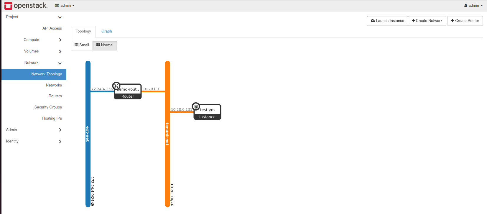<br/>**Network topology.** `ext-net`, `demo-router`, `tenant-net` and the test instance | 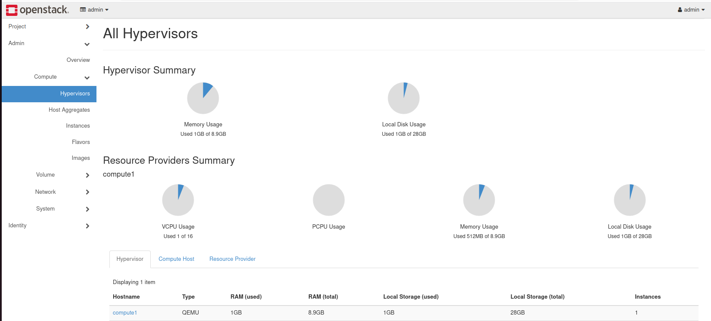 <br/>**Hypervisor summary.** compute1 vCPU, RAM and disk usage |
| 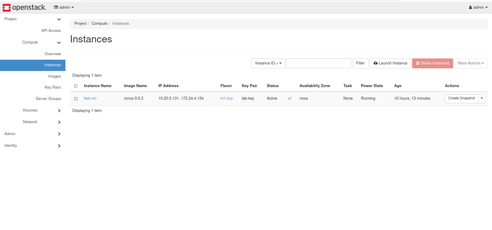<br/>**Instance.** `test-vm` ACTIVE with its floating IP | 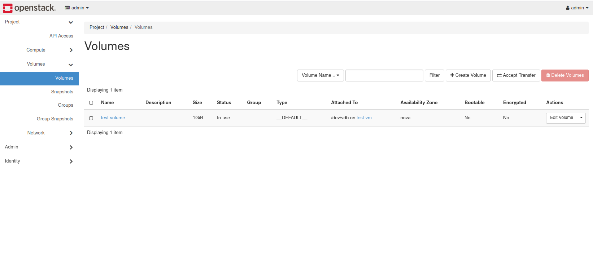 <br/>**Volume.** `test-volume` attached as `/dev/vdb` |
| 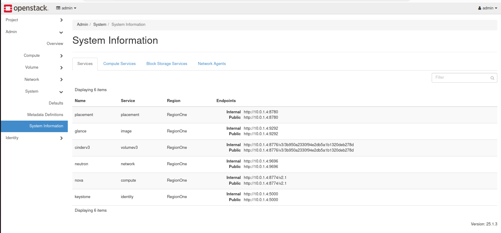<br/>**System information.** Compute, network and block-storage services all up | |
### Command line
| | |
|---|---|
|  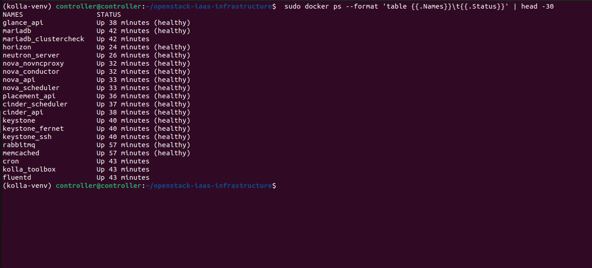<br/>**Kolla containers** running on the cluster nodes | 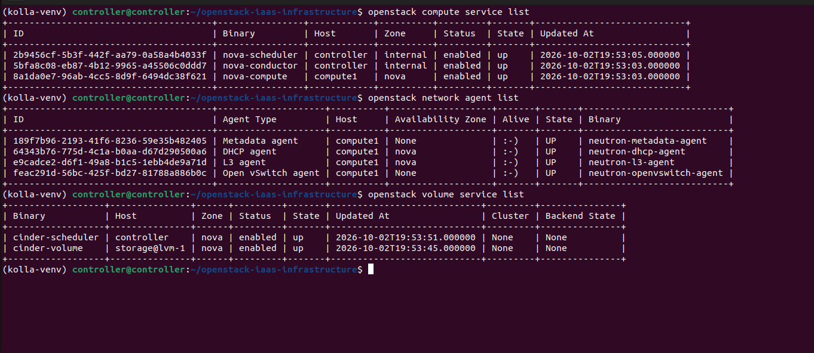 <br/>**Service and agent status** from `openstack` |
## Skills demonstrated

| Area | Evidence in this repo |
|---|---|
| **Cloud / IaaS** | Deployed and operated Keystone, Nova, Neutron, Glance, Cinder, Placement, Horizon |
| **Infrastructure as Code** | Ansible playbooks, Jinja2 templating, idempotent design, `make` orchestration |
| **Containers** | Kolla-Ansible container lifecycle, image pre-pull, health checks, `docker exec` debugging |
| **Software-defined networking** | Open vSwitch, VXLAN, flat provider networks, Neutron routers, namespaces, floating IPs |
| **Message queues** | RabbitMQ/AMQP role in OpenStack RPC, heartbeats, agent liveness, failure behaviour |
| **High-availability patterns** | HAProxy + Keepalived VIP, health-check-driven failover, honest single-node trade-offs |
| **Storage** | LVM, iSCSI (tgt/iscsid), NFS, GPT/XFS provisioning for Swift |
| **Linux & virtualisation** | KVM/libvirt, nested virtualisation, netplan, sysctl, systemd, routing tables |
| **Troubleshooting** | Packet captures per interface, per-namespace route inspection, log triage, root-cause write-ups |
| **Engineering discipline** | Verification gates, safety assertions, pinned dependencies, documented decisions |

---

## Quick start

> Prerequisites: three Ubuntu 22.04 VMs on a shared ZeroTier network, a per-node user matching `inventory/hosts.yml`, VT-x exposed to `compute1`, and the extra disks/NICs described above. Set your 16-character network ID in `inventory/group_vars/all.yml` first.

```bash
# --- Phase 1: foundation (run on the controller) ---
./scripts/controller-init.sh        # pinned Ansible venv + SSH key
./scripts/distribute-keys.sh        # copy the key to every node
make ping                           # connectivity check
make sudoers                        # passwordless sudo, per node
make all                            # baseline → network → storage → compute → preflight

# --- Phase 2: OpenStack via Kolla-Ansible ---
make vol2                           # prepare → config → bootstrap → prechecks → pull → deploy → post → cloud

# --- Phase 3: prove it works ---
make test-vm                        # VM + volume + floating IP + router reachability
```

Verify:

```bash
source ~/admin-openrc.sh
openstack compute service list
openstack network agent list        # every agent should be alive
openstack volume service list
```

Dashboard: `http://10.0.1.5` (Horizon, via the Keepalived VIP).

> **Phase 4 (floating-IP access from the overlay)** is documented step by step in [docs/06-floating-ip-access.md](docs/06-floating-ip-access.md).

---

## Repository layout

```
.
├── Makefile                      # one-command orchestration for every phase
├── ansible.cfg                   # pipelining, SSH multiplexing, YAML output
├── inventory/
│   ├── hosts.yml                 # nodes and role groups (control / network / compute / storage)
│   └── group_vars/all.yml        # <-- single source of truth
├── playbooks/
│   ├── 00-sudoers.yml  01-baseline.yml  02-network.yml  03-storage.yml  04-compute.yml
│   ├── 99-preflight.yml          # resource, MTU/loss, KVM, LVM, NFS gates
│   ├── 10-kolla-prepare.yml  11-kolla-config.yml
│   ├── 20-openstack-cloud.yml    # networks, router, flavors, image, keypair
│   └── 21-workload-test.yml      # end-to-end proof
├── templates/
│   ├── globals.yml.j2            # generated Kolla configuration
│   └── multinode.j2              # generated Kolla inventory
├── scripts/                      # controller-init · distribute-keys · kolla wrapper · ZeroTier authoriser
└── docs/
    ├── 01-architecture.md        ├── 04-design-decisions.md
    ├── 02-openstack-services.md  ├── 05-troubleshooting-log.md
    └── 03-build-process.md       └── 06-floating-ip-access.md
```

---

## Known limitations (stated honestly)

- **Single controller.** The VIP/HAProxy/Keepalived pattern is implemented, but with one control node it is a demonstration of the pattern, not real redundancy. MariaDB and RabbitMQ are single instances.
- **Combined compute + network node.** `compute1` is a shared failure domain for VMs and routing.
- **Overlay performance.** ZeroTier links were relayed (~100–300 ms), so storage I/O and RPC are slower than on a shared LAN. This was a deliberate trade-off, not an oversight.
- **Not enabled yet:** Swift (disk prepared), Cinder backup, Heat.
- **Lab credentials/IDs:** `zt_network_id` in `group_vars/all.yml` is a placeholder to replace.

## Roadmap

- [ ] Ring-build and enable **Swift** object storage
- [ ] Add a Cinder backup backend, then re-enable `cinder-backup`
- [ ] Add a second controller for a true HA control plane (clustered MariaDB + RabbitMQ)
- [ ] Add a second compute node and exercise live migration
- [ ] Enable **Heat** for orchestration templates
- [ ] Observability stack (Prometheus / Grafana)
- [ ] Automate Phase 4 as a playbook

---

<div align="center">

**Built, broken, debugged and documented — every decision and incident is recorded in [`docs/`](docs/).**

</div>