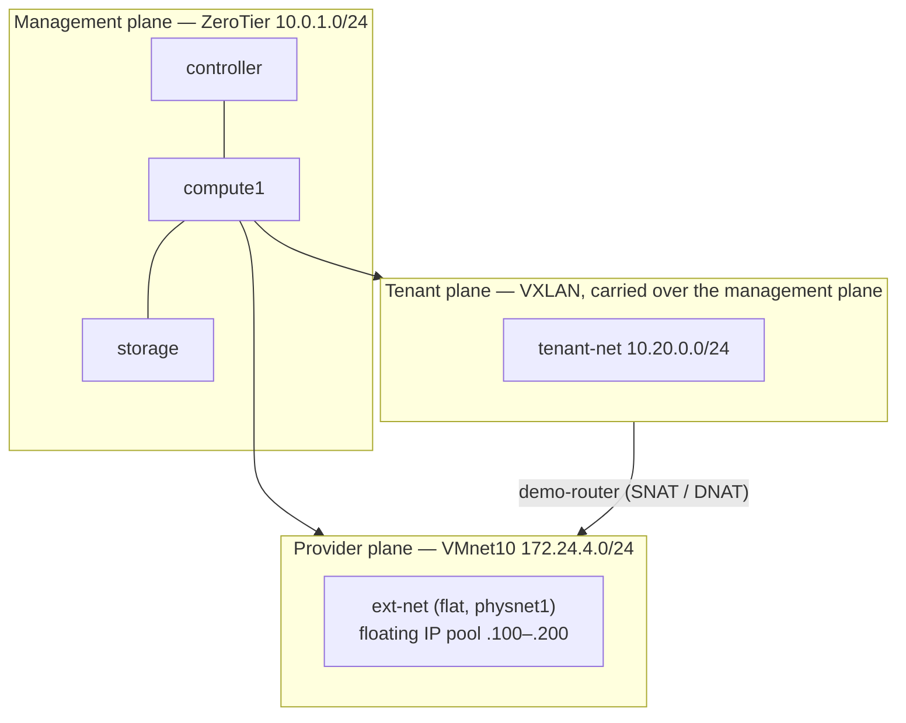
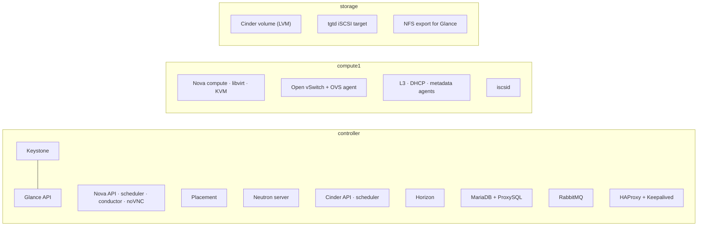
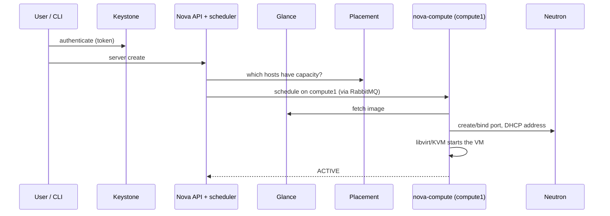
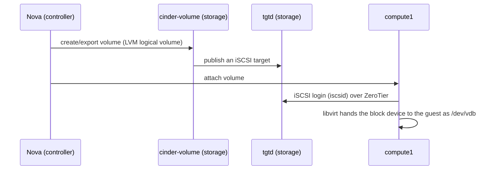

# 01 — Architecture

## Physical and virtual layout

Three machines each run one Ubuntu Server 22.04 VM under VMware Workstation. The VMs are joined by a ZeroTier virtual network, so they behave as if on one LAN even when the host machines are on different networks.

| Node | vCPU / RAM / disk | ZeroTier IP | Extra hardware |
|---|---|---|---|
| controller | 4 / 16 GB / 80 GB | 10.0.1.4 | — |
| compute1 | 4 / 9 GB / 30 GB | 10.0.1.6 | Nested virtualisation (VT-x); two extra NICs on VMware `VMnet10` |
| storage | 4 / 8 GB / 50 GB | 10.0.1.7 | 20 GB OS disk, 15 GB Cinder disk, 15 GB Swift disk |
| *VIP* | — | 10.0.1.5 | Floats to the controller via Keepalived; assigned to no node in ZeroTier |

## The three network planes



| Plane | Technology | Carries | Why separate |
|---|---|---|---|
| **Management** | ZeroTier overlay | API calls, database, message queue, iSCSI, Ansible/SSH, image transfer | Works across sites; stable addressing independent of VMware NAT |
| **Tenant (self-service)** | VXLAN encapsulation between Open vSwitch instances | Traffic between instances on user-defined networks | Tenants create their own isolated networks and routers without touching the infrastructure |
| **Provider (external)** | Flat network on a dedicated NIC → `br-ex` | Floating-IP traffic between the cloud and the outside | A raw layer-2 segment is needed for a flat network; this cannot be stretched over a VPN |

## Service placement



The notable choice is that the **Neutron L3, DHCP and metadata agents run on compute1**, not on the controller. The only node with a provider NIC is compute1, and keeping the routing agents next to it means tenant and floating-IP traffic never crosses the slow overlay link just to be routed. See [decision D3](04-design-decisions.md#d3--neutron-network-agents-on-compute1).

The **load balancer is on the controller**, next to the services it fronts. See [D4](04-design-decisions.md#d4--haproxykeepalived-on-the-control-node).

## Data paths

### Booting an instance



### Attaching a Cinder volume



Every read and write to an attached volume crosses the overlay, so the storage↔compute link is the lab's performance limit.

### Reaching an instance by floating IP

```
          Overlay peer (e.g. controller 10.0.1.4)
                       │  ZeroTier
                       ▼
        compute1 ──(IP forwarding)──► access NIC 172.24.4.50 ──► VMnet10
                                                                    │
                                    Neutron router (qrouter namespace) DNAT 172.24.4.134 → 10.20.0.131
                                                                    │
                                                                 instance
 Reply: instance → router → (route 10.0.1.0/24 via 172.24.4.50) → compute1 → ZeroTier → peer
```

Details and the reason for the return route: [06 — Floating-IP access](06-floating-ip-access.md).
