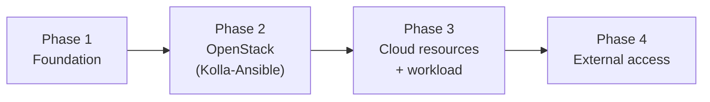

# 03 — Build process

The lab is built in four phases. Each phase is automated and ends with a verification gate, so a failure is caught where it happens rather than three steps later.



## Automation model

```
inventory/group_vars/all.yml     ← the only file you edit
        │
        ├── templates/multinode.j2 ──┐
        └── templates/globals.yml.j2 ┤  rendered by playbooks/11-kolla-config.yml
                                     ▼
                       /etc/kolla/multinode, /etc/kolla/globals.yml
                                     ▼
                      scripts/kolla.sh  →  kolla-ansible (pinned venv)
                                     ▼
                                 OpenStack
```

Two Python virtual environments are used on the controller: one for the repository's own Ansible (`~/.venvs/ansible`) and one for Kolla-Ansible (`/opt/kolla-venv`). Both are pinned, so results do not depend on whatever the distribution packages.

## Phase 1 — Foundation (`make all`)

| Step | Playbook | What it does | Verification |
|---|---|---|---|
| Access | `00-sudoers` | Per-node passwordless sudo for the automation account | `ansible -b -m command -a whoami` returns root everywhere |
| Baseline | `01-baseline` | Hostnames, `/etc/hosts`, packages, time sync, swap off, reboot if needed | Hosts entries present, swap `0` |
| Network | `02-network` | Discovers the ZeroTier interface, asserts each node holds its static IP | `/etc/openstack-lab.env` written |
| Storage | `03-storage` | Refuses to touch the OS disk; creates the Cinder VG, the Swift partition, the Glance NFS export | `vgs`, `lsblk`, `exportfs -v` |
| Compute | `04-compute` | Asserts VT-x and `/dev/kvm`; leaves the provider NIC up with no IP | `kvm-ok` |
| Preflight | `99-preflight` | RAM/CPU/swap minimums, full-mesh 1400-byte no-fragment pings (loss is a blocker, latency a warning), NFS mount-and-write test | `failed=0` on all nodes |

## Phase 2 — OpenStack (`make kolla-*`)

| Target | What happens |
|---|---|
| `kolla-prepare` | Cross-checks the ZeroTier interface and disk space on all nodes, **confirms the VIP is free**, builds the Kolla venv, generates passwords, installs Galaxy dependencies |
| `kolla-config` | Renders the inventory and `globals.yml`; prepares and mounts the Glance NFS share; writes Kolla's `ansible.cfg` (longer timeouts) |
| `kolla-bootstrap` | Installs Docker and host prerequisites on every node |
| `kolla-prechecks` | Kolla's own validation; must be clean before deploying |
| `kolla-pull` | Downloads all images first, separating network problems from deployment problems |
| `kolla-deploy` | Creates the service containers |
| `kolla-post` | Writes the admin credentials file |

## Phase 3 — Cloud resources and workload (`make cloud test-vm`)

`cloud` creates the provider and tenant networks, the router, flavors, image, keypair and security-group rules, each guarded by an existence check so it can be re-run.

`test-vm` proves the whole stack: boot an instance, create and attach a Cinder volume (waiting for the iSCSI attach to complete), allocate a floating IP, and ping the instance from the router namespace on compute1. Resources are looked up by ID, so repeated runs cannot create duplicates.

## Phase 4 — External access (`make access`)

Makes floating IPs reachable from the overlay network without involving the Windows host: a second provider-subnet NIC and IP forwarding on compute1, a Neutron route for the return path, and a persistent route on the controller. Explained in [06](06-floating-ip-access.md).

## Iteration history

The lab was built twice. The first iteration (on a different address range) proved the design but relied on manual commands and hand-written Kolla inventory. The second iteration rebuilt everything as code, with the lessons applied up front:

| Lesson from iteration 1 | Applied in iteration 2 |
|---|---|
| Hand-maintained inventory needed empty groups added one precheck failure at a time | Inventory generated from Kolla's shipped file |
| Neutron agents were first on the controller, then moved, leaving stale records to delete | Agents on compute1 from the start |
| VIP edited by hand in `globals.yml` | Rendered from one variable, with a pre-deploy check that the address is free |
| Mixed distribution/venv Ansible and a long environment-variable command | Pinned venvs and a one-line wrapper |
| Provider-network design discovered mid-way | Self-service plus provider networking designed in from the start |
