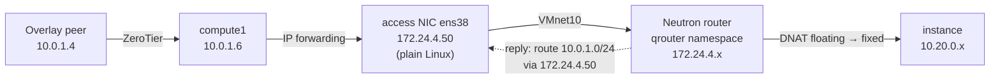

# 06 — Reaching floating IPs from the overlay network

**Goal.** A machine on the ZeroTier network (for example the controller) can `ssh` to an instance's floating IP, **without** turning the Windows host that runs VMware into a router, NAT gateway or firewall, and without touching Open vSwitch's provider NIC.

## The problem

Floating IPs live on the provider network (`172.24.4.0/24`, VMware `VMnet10`). The only machine attached to that segment inside the cluster is compute1, through a NIC that Open vSwitch owns (`master ovs-system`, port on `br-ex`). Two obstacles follow:

1. Overlay peers have no path to `172.24.4.0/24`.
2. Even if a request arrives, the instance's reply goes to the Neutron router, whose default gateway is the Windows host's VMnet10 adapter — which knows nothing about the overlay.

## The design



| Piece | Where | Purpose |
|---|---|---|
| **Access NIC** `172.24.4.50` | compute1, third adapter on VMnet10 | A normal Linux interface on the provider subnet, separate from the OVS-owned NIC |
| **IP forwarding** | compute1 (`/etc/sysctl.d`) | Lets compute1 pass packets between ZeroTier and the access NIC |
| **Forward route** `172.24.4.0/24 via 10.0.1.6` | Each peer that needs access (controller) | Equivalent of a ZeroTier managed route, which the free plan does not offer; kept alive by a systemd service |
| **Return route** `10.0.1.0/24 via 172.24.4.50` | On the Neutron router (`openstack router set --route …`) | Sends replies back through compute1 instead of the default gateway |

The return route matters because it is stored in Neutron's database: the L3 agent re-applies it every time it rebuilds the router namespace. A route added by hand inside the namespace works, but disappears when the namespace is recreated.

## Why not the alternatives

| Alternative | Why not |
|---|---|
| Give the OVS provider NIC a host IP | It belongs to `br-ex`; a host address on it interferes with Neutron |
| Make the Windows host route/NAT | Changes the host's networking and firewall; the point was to leave it untouched |
| NAT (masquerade) on compute1 | Works with one rule, but instances then log the router's address instead of the real client, and firewall state is needed |
| ZeroTier managed route | A paid feature |
| SSH `-J` through compute1 | Fine for SSH, but not for ping, HTTP or other protocols |

## Automation and verification

```bash
make access
```

(`playbooks/30-provider-access.yml`; requires the third NIC to be added in VMware first.)

```bash
# the router has the return route, rebuilt into the namespace by Neutron
openstack router show demo-router -c routes
ssh compute1@10.0.1.6 "sudo docker exec -u root neutron_l3_agent ip netns exec qrouter-<id> ip route"

# the controller routes the provider subnet via compute1
ip route get <floating-ip>

# end to end
ping -c 4 <floating-ip>
ssh cirros@<floating-ip>
```

If something fails, capture on both sides of compute1 while pinging:

```bash
sudo tcpdump -ni <zerotier-iface> icmp      # does the request arrive?
sudo tcpdump -ni ens38 icmp                 # does it leave, and does a reply return?
```

| Observation | Meaning |
|---|---|
| Request on ZeroTier, nothing on `ens38` | Forwarding is off, or the host's FORWARD chain drops it |
| Request on `ens38`, no reply | Security group or floating-IP association |
| Reply seen on `ens38`, nothing back on ZeroTier | The return route is missing from the router |
| Reply leaves through the OVS NIC | Same: the router used its default gateway |

## Persistence

| Element | Stored in | Survives reboot |
|---|---|---|
| Access NIC address | `/etc/netplan/61-vmnet10-access.yaml` | Yes |
| IP forwarding | `/etc/sysctl.d/99-compute1-router.conf` | Yes |
| Return route | Neutron database | Yes |
| Controller forward route | `zt-provider-route.service` | Yes, and re-applied if ZeroTier recreates its interface |
